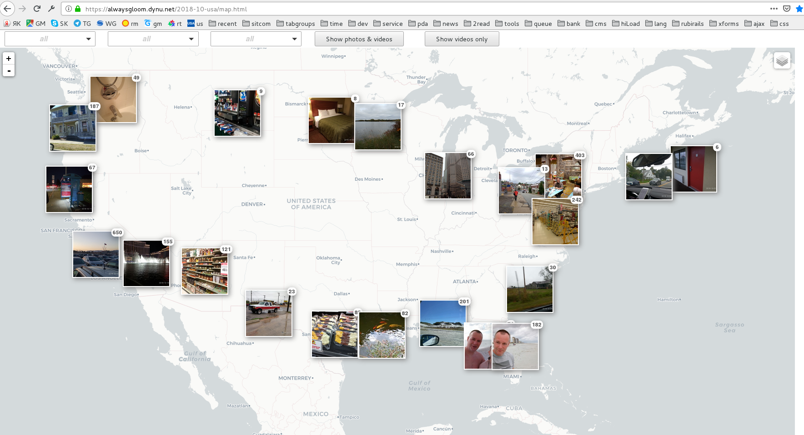

# photo-web-map
Web map with geotagged photo and video overlay

It's not a ready-to-use project, it is just a set of scripts (DIY style) created in order to build a serverless SPA:
web-map based on the Leaflet. This web-map should show clustered markers,
made from thumbnails from geotagged photo and video files
that I took on my trip to USA in year 2018.
Click on thumbnail should show full-size photo/video.

Web-map have a filter UI, allowing to show photos and/or videos according to selected date, state or town.
State and town names was produced with 'reverse geocoding' step of the build.

For detailed information about build see script [show.sh](scripts/show.sh).
Web-map details you can find in [map.html](web-map/map.html).
